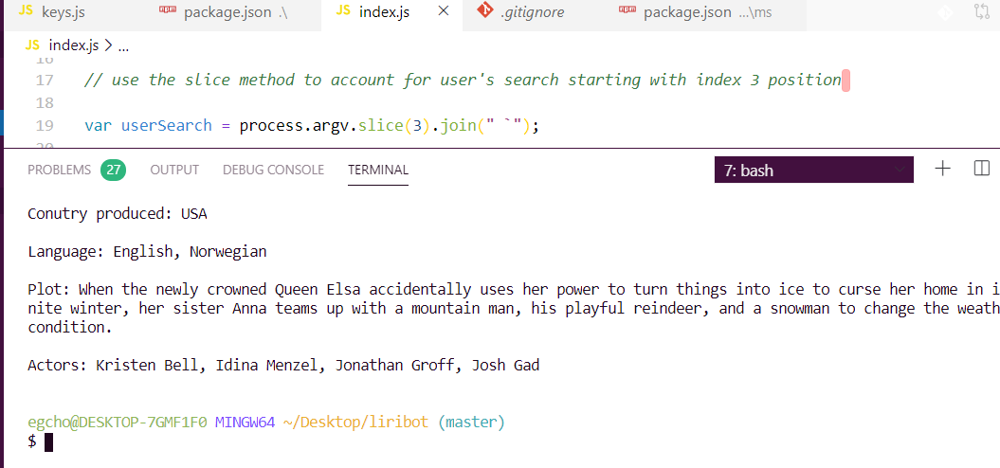

# LIRI Bot
### Overview
In this assignment, you will make LIRI. LIRI is like iPhone's SIRI. However, while SIRI is a Speech Interpretation and Recognition Interface, LIRI is a Language Interpretation and Recognition Interface. LIRI will be a command line node app that takes in parameters and gives you back data.

LIRI will search Spotify for songs, Bands in Town for concerts, and OMDB for movies.

Applications Used:
1. Node-Spotify-API
2. Axios
3. Moment
4. DotEnv

**LiriBot will take in a specific command and render results based on the specified command.**
- spotify-this-song
- movie-this
- concert-this
- do-anything-you-want

EXAMPLE
`movie-this` command:

- [x] bugs/errors still present
