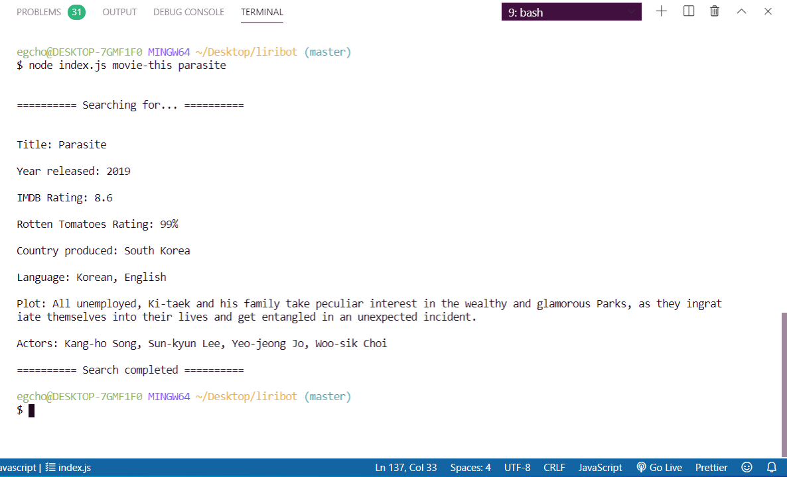

# LIRIBot
### Overview
LIRI is a Language Interpretation and Recognition Interface. LIRI will be a command line node app that takes in parameters and gives you back data.

LIRI will search Spotify for songs, Bands in Town for concerts, and OMDB for movies.

Applications Used:
- [x] Node-Spotify-API
- [x] Axios
- [x] Moment
- [x] DotEnv

**LiriBot will take in a specific command and render results based on the specified command.**
- movie-this
- spotify-this-song
- concert-this
- do-what-it-says

#### 1. EXAMPLE:
`movie-this` *command for movie* **"Parasite"**

#### 2. EXAMPLE:
`spotify-this-song` *command for song* **"Idol"**

#### 3. EXAMPLE:
`concert-this` *command for artist's concert* **"Halsey"**

#### 4. EXAMPLE:
`do-what-it-says` *command for default song & message*

######ASKING LIRI
> "What makes us human, I think, is an ability to ask questions, a consequence of our sophisticated spoken language."
> - jane Goodall
